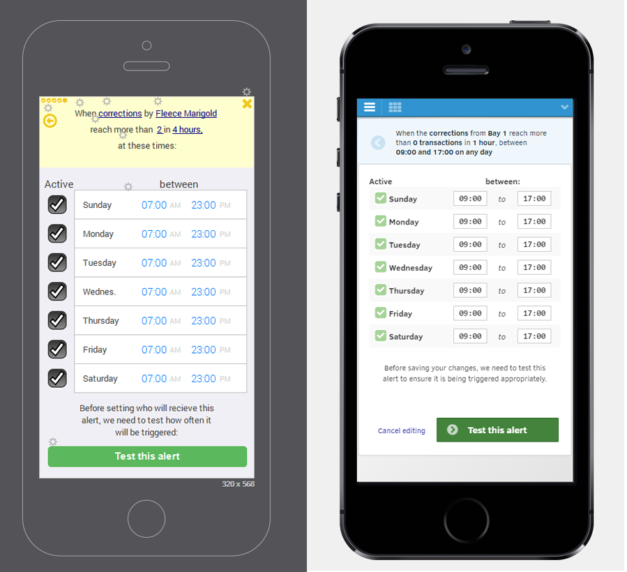
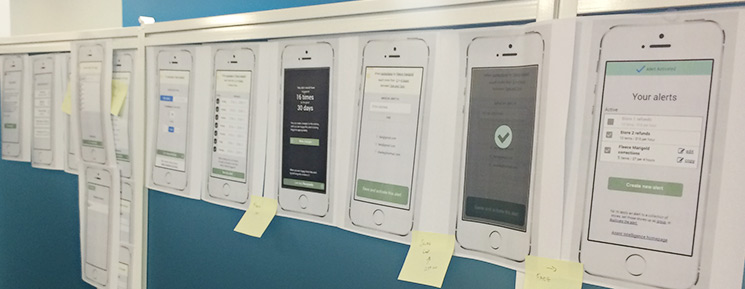
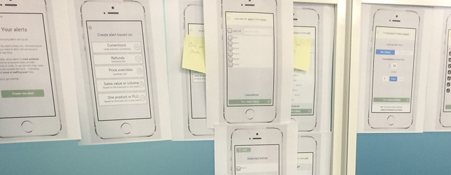

<section class="content__primary content-primary__multi-column">
    <h1 class="post--head__primary">Real time alerting</h1>
        <h2 class="post--head__subhead">Business intelligence for retail management</h2>
               <ul class="project__meta  no-marker">
                  <li>
                   Project published:
                    <time datetime="2016-09" class="project__meta--date">
                         September 2016
                     </time>
                    </li> 
                     <li>My role:
                         <ul class="project__role--profile">
                             <li>Research</li> 
                             <li>Process flow development</li> 
                             <li>Prototyping</li>
                             <li>Usability testing</li>
                             <li>Visual design</li>
                             <li>HTML &amp; CSS</li>
                         </ul>
                     </li>
                </ul>
              
            

                Full case study to follow. In the meantime, here's some screen shots of parts of the application and the development process.
            

              
        <figure class="project--image">
            <figcaption class="fig-caption--count">
            Comparison of a screen from the initial prototype, used for early process development and  usability testing, and the same screen in the finished application.
            </figcaption>
            
      
        </figure>
        
        <figure class="project--image">
             <figcaption class="fig-caption--count">
            Wireframed process flow iterated and referenced by the team throughout the project development
            </figcaption>
            
            
        </figure>
        
        <figure class="project--image">
            
    
        </figure>
        
</section>

<aside role="supplmental"  class="content__supplemental axent-alerts">
    
    
    
</aside>