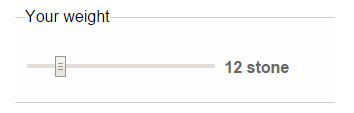
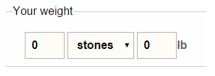
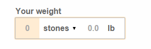

<section class="content__primary content-primary__multi-column">
    <h1><em class="pre-header">Better form controls part 1:</em> Date and weight inputs</h1>
       
               <ul class="project__meta  no-marker">
                  <li>
                   Project published:
                    <time datetime="-" class="project__meta--date">
                        <abbr title="Work in progress">WIP</abbr>
                     </time>
                    </li> 
                     <li>My role:
                         <ul class="project__role--profile">
                             <li><abbr title="User Experience">UX</abbr> &amp; visual design</li> 
                             <li>protoyping &amp; testing</li>
                             <li>implementation</li>
                         </ul>
                     </li>
                </ul>
                
               <!--  <figure class="image--header">
                    
                    <figcaption>Large photography and thumbnail navigation used to showcase the variety and quantity of foods available</figcaption>
               </figure> -->
            

               A project I&#39;m currently working on involves capturing a quantity of user information. It&#39;s fairly run of the mill of stuff, but there are a couple of data points that on the surface seem quite straight forward, but with a little inspection present some challenges and opportunities. Capturing date of birth is reguarily poorly executed &mdash;I can never understand why this is so often done with a calendar widget. Another challenge is a personal weight input which, in addition to the complexity of various user format preferences, has issues beyond the mechanics of the <abbr title="User interface">UI</abbr> that I&#39;ll discuss later.
             

             
                 <!-- blockquote class="callout__quote fullwidth--quote" >
                     
I never understand why date of birth is so often captured with a calendar widget

                 </blockquote -->
                 
             
The current inputs I&#39;m looking to replace aren&#39;t <em>terrible</em> &mdash; I&#39;ve certainly seen worse &mdash; but they could be improved. The date of birth input is a quite unforgiving in the format it will accept (but thankfully isn&#39;t a calendar!) and generates a lot of calls to the website support team. The weight (and similarily height) control doesn&#39;t as many problems directly, but being a two step process it seems more complex than is really nessecary. The requirement to be able to enter &frac12; pounds can cause confusion in its current implementation &mdash; illustrated in fig 1.

             
              <figure class="image--header">
                 
                 
                <figcaption>Fig 1: Current implementation is a two stage process: Select units, then enter  weight. </figcaption>
            </figure>
             
             <!-- p>I&#39;ll  document the thought, protoyping and testing process and hopefully come up with improvements to the these data iunput types that are so critical &mdash; the weight input particuarily &mdash; in my employers website. 

            
             <h2>Prototyping: Weight</h2>
             <h3>Approach 1: Range input</h3>
             
My initial instinct for the weight input is to use a sliding range form input.

             <figure class="content--figure">
                
                <figcaption>Fig 2: Basic range input</figcaption>
             </figure>
             
However, having quickly prototyped it with a snippet of javascript to update the display in real time, it&#39;s clear there are a couple of issues. Firstly, its not intuitive to use this format for non decimal input. Stones and pounds are the most popular format used on the website, so the point must reflect this in cycling through to 14. A problem, but not insurmountable.

             
Secondly, and more importantly, is the pyschological aspect of weight. The physical act of sliding upwards and seeing the weight ticking over rapidly could evoke negative feelings in users. Not what we want to achieve at all.

             
             <h3>Approach 2: Unified inputs</h3>
             
The second approach is to inline the inputs in a manner that is akin to natural conversation &mdash; <em>&lsquo; twelve&ndash;stone&ndash;two&ndash;pounds.&rsquo;</em> 

             
             <figure class="content--figure">
                
                <figcaption>Fig 3: Basic weight input</figcaption>
             </figure>
             
             
This approach allows the form to capture all the data required, but I&#39;d like to try and simplify it a little.

             
             <figure class="content--figure">
                
                <figcaption>Fig 4: Visually unified weight input</figcaption>
             </figure>
             
In Fig.4 I have styled the <code class="inline">&lt;fieldset&gt;</code> and <code class="inline">&lt;legend&gt;</code> surrounding the inputs to use the same styles as applied to a standard text input. I&#39;ve also adjusted the input margins and padding to make the clickable targets extend to the edges, and added a highlight on the input that has :focus.

             
             
I&#39;ve used <code class="inline">&lt;input type=&quot;number&quot;&gt;</code> to enable a numeric keypad on mobile devices. Due to similar issues as those  described for the range input type, I have disabled the browser default spinners on these inputs.

             
            <h2>Prototyping: Date of birth</h2>
            
A major problem with the current implementation is the users are required to enter the data in a very specific format.
 
            
            
My intention, as above, is to simplify and unify the inputs &mdash;  making it clear on the required data and assist users in quickly entering it.

   
          <h2>Testing</h2>
          
          
For testing I created two demonstration forms with the inputs as described above. They both have additional inputs to discourage  the testers from focusing solely on the two input areas I specifically want them to use.

          
          Test page 1 uses the form elements as described above.
          <a href="demo.html">demo 1</a> (Not production code, tested in Chrome for prototyping and testing purposes)
       
</section>

<aside role="supplmental"  class="content__supplemental sw-7-day-menu">
    
    
    
</aside>