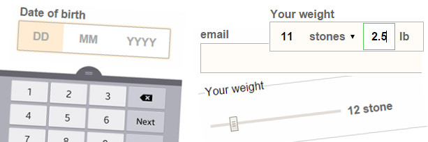

<h1 class="post--head__primary">Work</h1>
<!--<h2 class="post--head__subhead">A few of the things I&#39;ve made</h2>-->

<section class="work__entry sw-home">
     <a href="/work/sw-homepage-2015/">
        <h2 class="work--index__header">Case study: Slimming World Homepage</h2>
        
    </a>
</section>

<section class="work__entry better-forms">
     <a href="/work/better-form-inputs/">
        <h2 class="work--index__header">Case study: Improving form design</h2>
        
    </a>
</section>

<section class="work__entry sw-7day">
     <a href="sw-7day-menu.html">
        <h2 class="work--index__header">Weekly menu plan</h2>
        
    </a>
</section>

<section class="work__entry sw-resposive-email"> 
     <a href="responsive-email.html"> 
        <h2 class="work--index__header">Responsive email</h2>
        
    </a>
</section>

