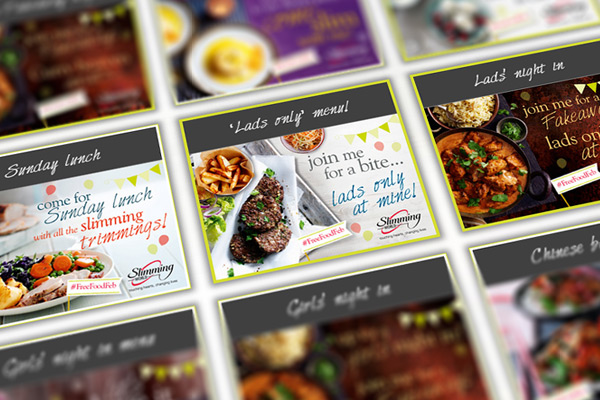

<!-- #footer-scripts: '
<link rel="stylesheet" href="/assets/css/featherlight.min.css">' -->
<section class="content__primary content-primary__multi-column">
    <h1 class="post--head__primary">Free Food February</h1>
        <h2 class="post--head__subhead">Interactive content to support offline campaign</h2>
               <ul class="project__meta  no-marker">
                  <li>
                   Project published:
                    <time datetime="2015-02" class="project__meta--date">
                         February 2015
                     </time>
                    </li>
                     <li>My role:
                         <ul class="project__role--profile">
                             <li>Graphic, <abbr title="User Interface">UI</abbr> &amp; interaction design</li>
                             <li>implementation &amp; testing</li>
                         </ul>
                     </li>
                </ul>
                
     <figure class="image--header">
                    
                    </figure>
 

            

                This was a very quick turnaround project to support an offline and social media campaign running throughout February 2015.

                
The brief involved taking exisiting print assets and generating an interactive &lsquo;menu picker&rsquo;, allowing users to select a party theme and get tailored recipes and party paraphernalia. Having selected a menu, users were given the option to send themed email invitations to friends and family.

                  
                  <a class="read-more" href="FreeFoodFeb/index.html">
                   demo
                    </a>
               
                

            
</section>

<aside role="supplmental"  class="content__supplemental">

    

</aside>
