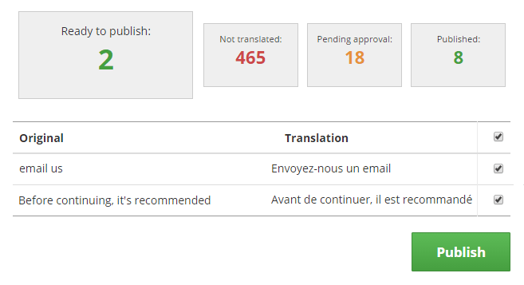

<section class="content__primary  content-primary__multi-column">
    <h1 class="post--head__primary">Translator application</h1>
        <h2 class="post--head__subhead">Application wrapper for generating in&#45;context translations</h2>
            
            <ul class="project__meta no-marker">
                  <li>
                   Project published:
                    <time datetime="2016-02" class="project__meta--date">
                         February 2016
                     </time>
                    </li> 
                     <li>My role:
                         <ul class="project__role--profile">
                             <li><abbr title="User Experience">UX</abbr> &amp; <abbr title="User Interface">UI</abbr> design, testing and implementation</li> 
                         </ul>
                    </li>
              </ul>
            
            

            This was a short term project to take a previously developed prototype  and transform it in to a production ready application. 
            

                 
                 
The goal of the translator application is to allow international partners to easily provide native language translations for a small range of B2B products.

            
              
The translator application takes a &lsquo;framed window&rsquo; approach, consisting of tools to create translations, and an iframed instance of the application to be translated.

               
The prototype application was largely complete for the core functionality, but I quickly identified a number of opportunities for improving the user experience.

               
 
             <h3>Role types</h3>
              
The application was developed to be used by two distinct groups of actors:

              <ul>
                  <li><h4>Translators</h4>
                  
Providing translations for screens in the target application.

                  </li>
                  <li>
                  <h4>Authorisers</h4>
                   
Reviewing submitted translations, and rejecting or authorising them for use in the live application.

                   </li>
               </ul>
               
               
The authorise role in the prototype presented a significant problem, in that it immediately published authorised translations to the target applications production environment. This resulted in partial and unfinished language packs going live to end users. 

               
I designed an additional step in the authorise process allowing for collation of  groups of authorised text that could be put into production collectively.

              
              <figure class="project--image translate--flow image--header">
                 <figcaption class="fig-caption--count">Partial view of the Authorisation process diagram</figcaption>
                   
              </figure>
              
              <figure class="project--image authorise--submitted">
                 <figcaption class="fig-caption--count">Balsamiq mockup of an authorisation confirmation dialog.</figcaption>
                   
              </figure>
              
               <figure class="project--image translate--publish image--header">
                 <figcaption class="fig-caption--count">The main publish screen allows groups of translations to be published en masse</figcaption>
                   
              </figure>
              
              
              <h3>Visual style</h3>
              
I felt the translation application needed to be visually distinct from the application being translated. I created a dark theme that contrasts well with the applications to be translated.

              
I used a simple &lsquo;traffic light&rsquo; colour scheme to, in conjunction with text labels, emphasise statuses throughout the application. (Fig. 3) 

              
              <figure class="project--image translate--labels">
                 <figcaption class="fig-caption--count">Status labels are reinforced through a simple colour scheme</figcaption>
                   
              </figure>
              
              <h3>Workload progress</h3>
              
I created an overview page with cards (Fig.4) summarising the current status of each application requiring translation, and providing clear signposting to appropriate actions (Translate, review, publish).

              
I introduced some subtle gamification by laying out the overall status of each application for each target languages in the form of a &lsquo;league&rsquo; table.

              
            <figure class="project--image translate--cards">
                 <figcaption class="fig-caption--count">Each application to be translated is featured on the overview page with a summary card.</figcaption>
                   
            </figure>
              
              
              <h3>Responsive layouts</h3>
              
During testing it became clear that problems caused by differing text and line length between languages could be hidden within the context of the translation application.  

              
The main environment for translating is desktop computers with reasonably large screens. The applications to be translated are built responsively, but the view seen within the context of the translator is generally a large screen layout. Text overflow problems are sometimes only visible at smaller screens sizes.

              
I built a simple jQuery mechanism to allow the user to resize the host iframe,  triggering layout variations to check for any text length issues.

         <figure class="project--image translate--draggable">
                 <figcaption class="fig-caption--count">A simple drag handle allows the user to resize the iframe to check for any text overflow problems.</figcaption>
                   
            </figure>
       
           <h3>Screenshots</h3>
           <h4>Click to enlarge</h4>
             <figure class="project--image translate--screen">
             
            </figure>
            <figure class="project--image translate--screen">
             
            </figure>
            <figure class="project--image translate--screen">
            
            </figure>
            <figure class="project--image translate--screen">
             
            </figure>
            <figure class="project--image translate--screen">
               
            </figure>
            <figure class="project--image translate--screen">
             
            </figure>  
</section>

<aside role="supplmental"  class="content__supplemental px-translator">
    
    
    
</aside>
